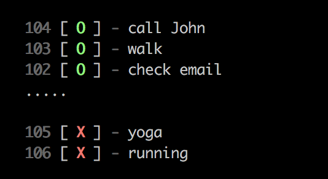
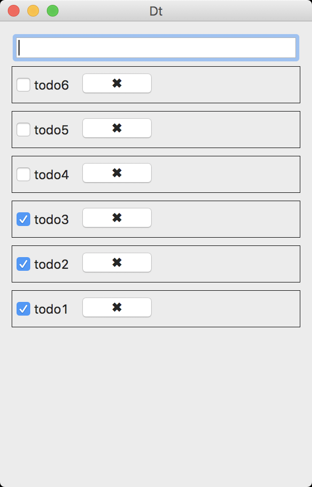

# Dt

Manage your tasks with ease.

## Use with command line



### Usage

```
Usage:
  => dt [options] [args...]

Options:
  -l       List all items
  -a       Add an item           [string]
  -d       Delete an item by id  [string]
  -f       Finish an item by id  [string]
  -r       Redo an item by id    [string]
  -v       Print current version
  --clear  Clear all items
```

---

## Use with gui app(osx)



## Prerequisite

The tool requires a redis server for storing data.

If you haven't a redis server installed locally, check the offical [doc](https://redis.io/download) for installing.

For macOS, simply use `brew install redis` and `brew services start redis`

## Install

### Command line app

For macOS users, you are able to install with homebrew: `brew tap cyyyu/tap && brew install dt`

Or you can download the binary file [here](https://github.com/cyyyu/dt/releases)

### Gui app

Download the app here: [here](https://github.com/cyyyu/dt/releases)

### License

MIT @ [Chuang Yu](https://github.com/cyyyu)
